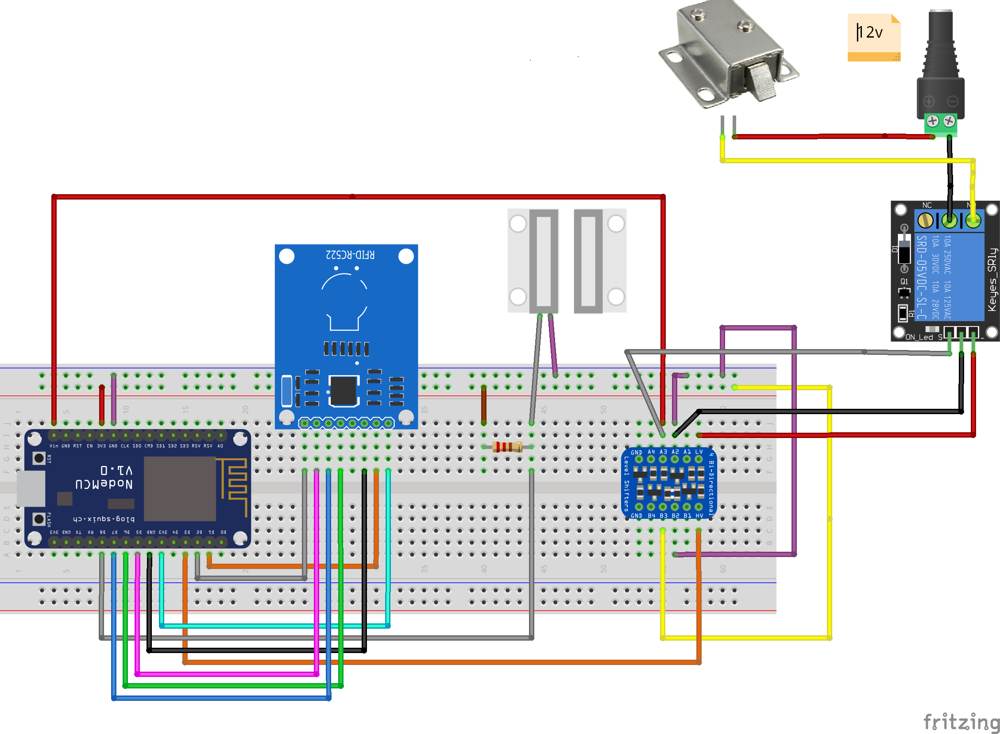
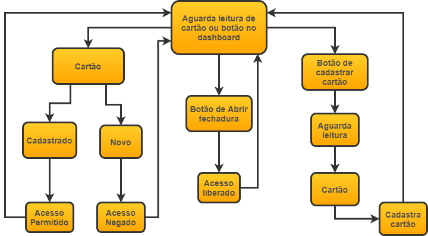
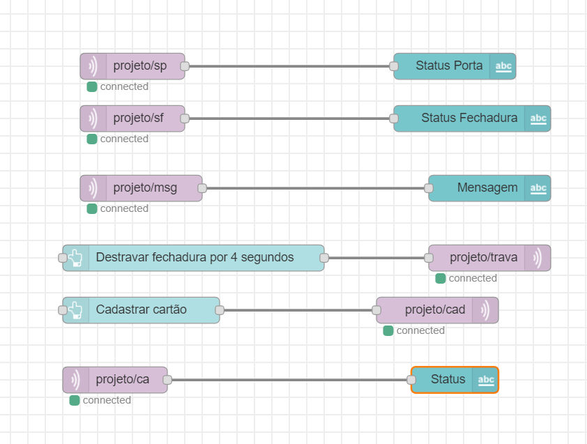

# SmartLocker com leitor RFID e monitoramento Web.
### Juliano Gomes e Felipe Martinez

### Breve descrição
Projeto de uma fechadura eletrônica com leitura RFID e integração MQTT.
O projeto monitora e aciona uma fechadura elétrica. O monitoramento é feito via dashboard do Node-RED com auxilio do MQTT, assim consta o estado da porta, o estado da fechadura e o estado total do sistema. A ação de desbloquear a fechadura pode ser feita de duas formas, uma através de botão no dashboard ou através de cartão NFC autorizado.
O cadastro de cartões é autorizado pelo dashboard através de um botão que faz com que o próximo cartão lido seja cadastrado. 


### Componentes
1.  Microcontrolador : Node MCU - ESP8266 ESP-12 
2.  Módulo leitor RFID
3.  Mini trava elétrica solenoide 12V
4.  Módulo relé 5v
5.  Sensor Magnético MC-38
6.  Resistor 300Ω
7.  Fonte 12V

[A montagem dos componentes esta aqui](images/montagem.png)

O microcontrolador é responsável por conectar todos os outros módulos, o sensor MC-38 retorna o estado da porta, se está fechada ou aberta. O módulo relé e a fonte de 12V são necessários para acionar a fechadura. O leitor RFID faz a leitura dos cartões NFC. 

### Software 
O fluxograma abaixo representa o que o sistema está esperando para assim tomar sua decisão.
[Para ir para a imagem](images/diagrama_fluxo.png)  


O software foi desenvolvido na IDE do arduino então são necessárias algumas bibliotecas que podem ser encontradas [neste link](https://github.com/esp8266/Arduino/) 


O [código](smartlocker.ino) está com comentários para auxiliar no entendimento. Porem acho importante ressaltar 3 partes.

#### Função Callback
```
void callback(char* topic, byte* payload, unsigned int length) {
  inString="";
  Serial.print("Message arrived [");
  Serial.print(topic);
  Serial.print("] ");
  //Serial.print(payload);
  
  for (int i = 0; i < length; i++) {
    Serial.print((char)payload[i]);
    inString+=(char)payload[i];
  }
  char a = topic[8];
  bool b = a == 'c';
  Serial.println(b);
  if(b){
    programMode = true;
    client.publish("projeto/ca", " Esperando cartão!!");
  }else{
    client.publish("projeto/sf", " Acesso liberado");
    abrir(4000);
    client.publish("projeto/sf", "Acesso bloqueado");
  }
}

``` 
Está função é responsavel receber os paramêtros enviados pelos botões do dashboard no Node-RED e assim alterar os estados do sistema. Ela verifica se o paramêtro enviado foi para entrar em modo cadastro de cartão ou para abrir a fechadura.

#### Conectar ao broker e leitura de Cartão
```
if (!client.connected()) {
    reconnect();
  }
  client.loop();
  //posição fechada da trava
  digitalWrite(trava, HIGH);
  //leitura de cartão
  if ( ! mfrc522.PICC_IsNewCardPresent()) { 
    return ;
  }
  if ( ! mfrc522.PICC_ReadCardSerial()) {   
    return ;
  }
  Serial.println(F("ID:"));
  for ( uint8_t i = 0; i < 4; i++) {  //
    readCard[i] = mfrc522.uid.uidByte[i];
    Serial.print(readCard[i], HEX);
  }
  Serial.println("");
  mfrc522.PICC_HaltA();
  ```
  Esta parte do código é importante para estabelecer a conexão com o broker e se isso ocorrer esperar uma leitura do cartão RFID;
  
 #### Váriaveis
  O programa é capaz de gravar apenas 4 cartões NFC, que ficaram nas variaves sd . A variável readCard serve como transição para ver qual foi a leitura do sensor RFID.
  ```
  byte sd1[4];
  byte sd2[4];
  byte sd3[4];
  byte sd4[4]; 
  byte readCard[4];  
  ```
  
 ### MQTT
 Foi usado um broker publico no projeto: broker.mqtt-dashboard.com A conexão se manteve estável o tempo todo. São 4 nós de publish e 2 de subscribe. 
 Os nós e seus respectivos tópicos podem ser vistos [aqui](images/NodeRed.png). 
 
 
 [Para acessar o conjutos dos nós no node](nodeSmartLocker.json) 


### Dashboard
O [dashboard](images/dashboard.png) utilizado no Node-RED está na imagem abaixo, o botão cadastra cartão é responsável por indicar que o próximo cartão lido será cadastrado e o status acima indica se foi ocrrido. Do outro lado as 3 primeiras linhas mostram a ultima ação do sistema, o estado da porta e o estado da fechadura respectivamente e o botão abaixo abre a fechadura por 4 segundos.

Os nós e seus respectivos tópicos podem ser vistos [aqui](images/dashboard.png). 
